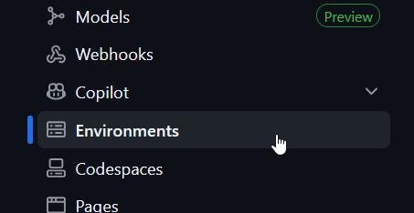
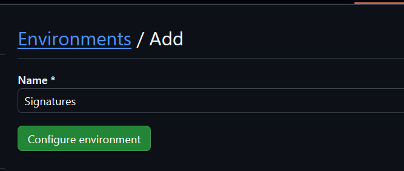
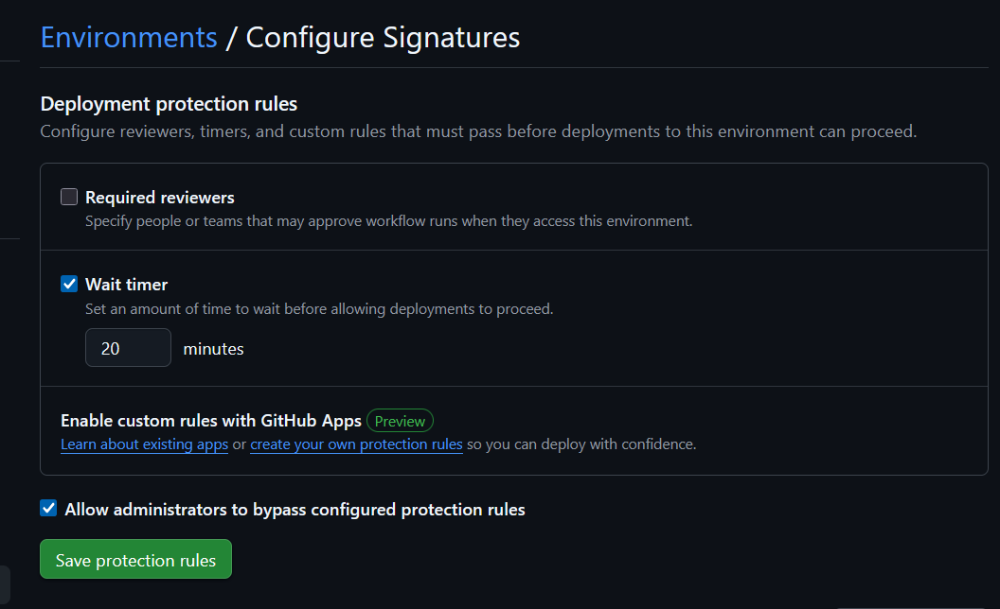

# example-workflow
This is an example workflow with instructions on how to set up the remote approval flow for OSSign

## .github/workflows/win-build.yml
Builds your application and then dispatches a request to OSSign for signing. After dispatching, it starts a waiting loop to wait for the signed files to be available.

### Set the secrets
To use this workflow, you need to set the following secrets in your GitHub repository. You will get these details from OSSign after your application has been approved for signing.
- `OSSIGN_USER`: Your OSSign username
- `OSSIGN_TOKEN`: Your OSSign token

## .github/workflows/wait-signature.yml
This workflow is started by the waiting loop in the build workflow. It periodically checks with OSSign to see if the signing is complete. Once the signed files are available, you can add steps to download and use them as needed.

### Waiting loop setup
To set up the waiting loop, start by creating a new environment:
1. Go to your GitHub repository.
2. Click on "Settings" > "Environments".

3. Create a new environment named `Signatures`. 

4. In the environment settings, check the "Wait timer" option and set it to 20 minutes 

5. Click "Save protection rules".

When setting the secrets, those need to be set outside of the environment.
